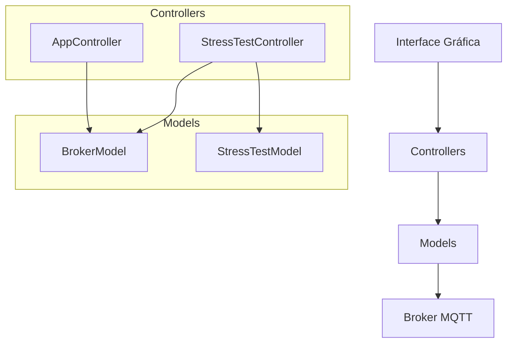
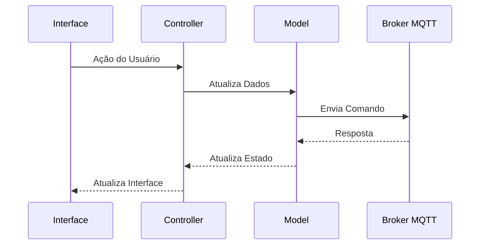
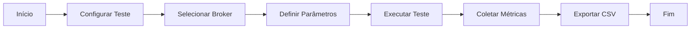

# MQTT Client

Um cliente MQTT com interface gráfica desenvolvido em Python usando a biblioteca Textual para testes e monitoramento de mensagens MQTT.

## Funcionalidades

- Conexão com múltiplos brokers MQTT
- Visualização em tempo real de tópicos e mensagens
- Interface gráfica intuitiva
- Teste de estresse com métricas
- Exportação de resultados para CSV
- Suporte a diferentes tipos de payload (texto, JSON)

## Arquitetura



## Fluxo de Dados



## Fluxo de Teste de Estresse



## Requisitos

- Python 3.8+
- pip (gerenciador de pacotes Python)

## Dependências

- textual
- gmqtt
- asyncio

## Instalação

1. Clone o repositório:
```bash
git clone https://github.com/DevMiguelPinheiro/MQTT-CLIent.git
cd MQTT-CLIent
```

2. Crie e ative um ambiente virtual:
```bash
python -m venv venv
source venv/bin/activate  # Linux/Mac
# ou
.\venv\Scripts\activate  # Windows
```

3. Instale as dependências:
```bash
pip install -r requirements.txt
```

## Uso

1. Execute o programa:
```bash
python src/main.py
```

2. Na interface principal:
   - Pressione 'a' para adicionar um novo broker
   - Pressione 's' para acessar o teste de estresse
   - Use as setas para navegar na árvore de tópicos
   - Pressione Enter para conectar ao broker selecionado

3. Teste de Estresse:
   - Selecione um broker conectado
   - Configure o tópico, número de mensagens, intervalo e tamanho
   - Clique em "Executar Teste" ou pressione F5
   - Os resultados podem ser exportados para CSV

## Estrutura do Projeto

```
src/
├── controllers/
│   ├── app_controller.py
│   └── stress_test_controller.py
├── models/
│   ├── broker.py
│   └── stress_test.py
├── views/
│   ├── screens.py
│   └── stress_test_screen.py
└── main.py
```

## Atalhos de Teclado

- `q`: Sair do programa
- `a`: Adicionar novo broker
- `s`: Acessar teste de estresse
- `Enter`: Conectar ao broker selecionado
- `F5`: Executar teste de estresse
- `Esc`: Voltar à tela anterior

## Configuração de Brokers

Os brokers são salvos no arquivo `brokers.txt` no formato:
```
nome_broker,host,porta
```

## Resultados de Teste

Os resultados dos testes de estresse são salvos na pasta `results/` com o formato:
```
results/stress_test_YYYYMMDD_HHMMSS.csv
```

## Contribuindo

1. Faça um fork do projeto
2. Crie uma branch para sua feature (`git checkout -b feature/nova-feature`)
3. Commit suas mudanças (`git commit -m 'feat: adiciona nova feature'`)
4. Push para a branch (`git push origin feature/nova-feature`)
5. Abra um Pull Request

## Licença

Este projeto está sob a licença MIT. Veja o arquivo [LICENSE](LICENSE) para mais detalhes.

## Autor

- Miguel Pinheiro - [GitHub](https://github.com/DevMiguelPinheiro)

## Agradecimentos

- Textual Framework
- GMQTT Library
- Comunidade Python 